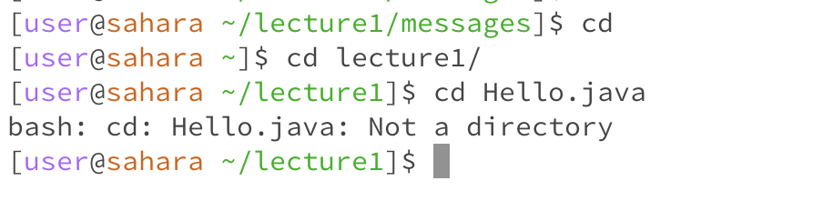

# Lab 1


1) No arguments
    - Changes directory to the home directory. With no arguments it seems
    that this is the default behaviour for the command. It is useful as the home directory is a very important directory, so it would make sense it has a shortcut.
    - Not an error.
2) Folder argument
    - Changes directory to `~/lecture1`. The argument, if a folder, becomes the new location for the terminal.
    - Not an error.
3) File argument
    - Does not change directory as the parameter is not a directory. You cannot have files as a directory because commands like `ls` and `mkdir` lose meaning in such a scenario. You can't list the contents of something that isn't a container.
    - Error because you cannot use a file as a directory.


1) No arguments
    - Not sure exactly what is happening, I think it is opening a iostream from the terminal and reprints the input on enter. As per `man` documentation: `Copy standard input to standard output.`
    - Not an error.
2) Folder argument
    - Does not print anything since there is an error.
    - Error because you cannot print the "binary data" of a directory.
3) File argument
    - Prints out the entire file in UTF-8 by default.
    - Not an error.


1) No arguments
    - Lists the current directory's children.
    - Not an error.
2) Folder argument
    - Lists the children of the parameter directory, this is the same as changing your working directory, running `ls` and changing back.
    - Not an error.
3) File argument
    - Prints the relative directory of the parameter file. It's interesting because it doesn't just repeat the parameter, it does evaluate it. e.g.
    ```bash
    [cs15lfa23rz@ieng6-202]:~:44$ ls ~/.ssh/authorized_keys 
    /home/linux/ieng6/cs15lfa23/cs15lfa23rz/.ssh/authorized_keys
    ```
    - Not an error.
