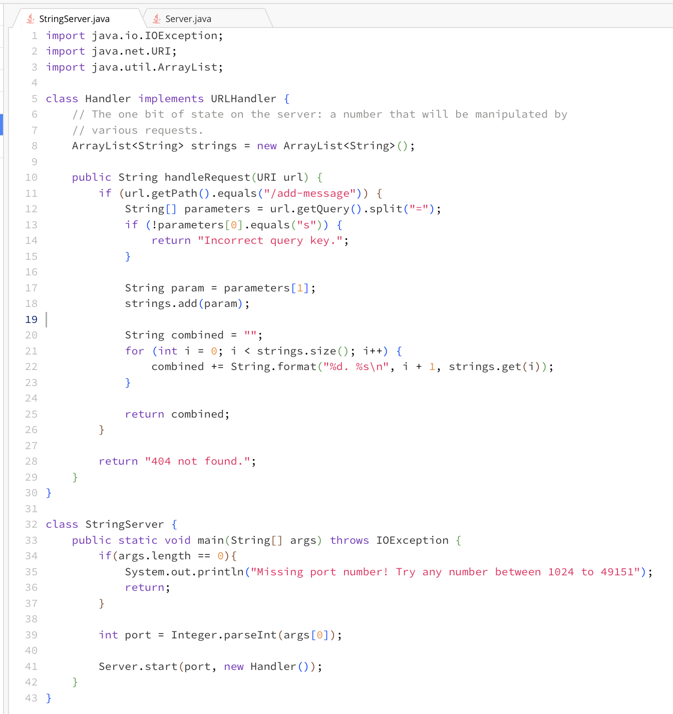
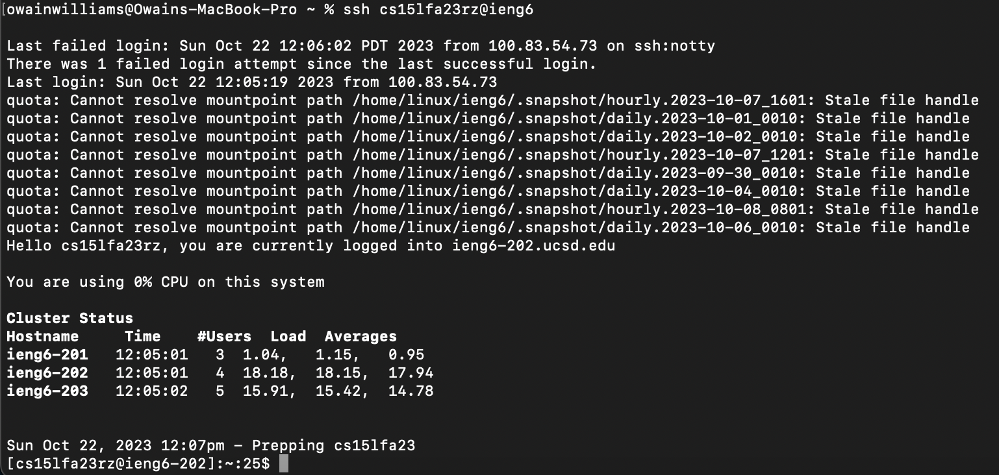

## Lab 2

### SSH Command

```bash
ssh cs15lfa23rz@ieng6
```

### Part 1




### Part 2




### Part 3 

I learned what "notty" meant. It means "no teletype" and it is shown when
connecting to a server via SSH.

```txt
Last failed login: Sun Oct 22 12:06:02 PDT 2023 from 100.83.54.73 on ssh:notty
```

It means that it is not a physical connection to the server e.g. a keyboard
plugged into a computer. The ssh part simply means it's a connection on
port 22. So ssh:notty effectively means "a remote connection on port 22."