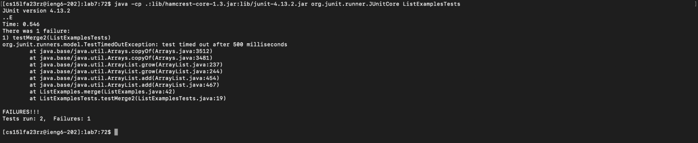
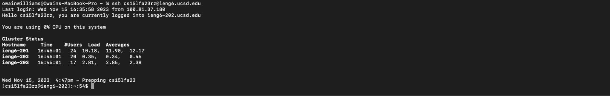
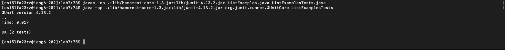
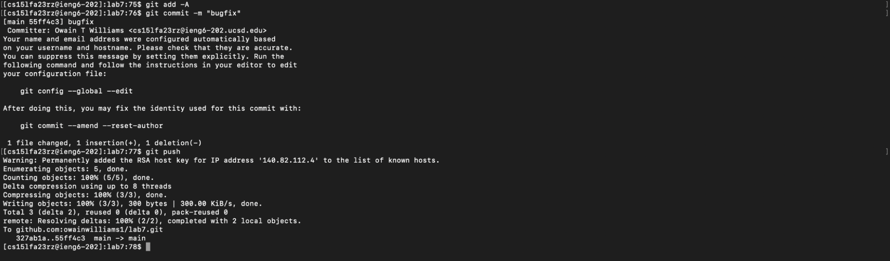
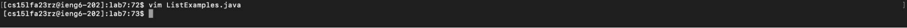
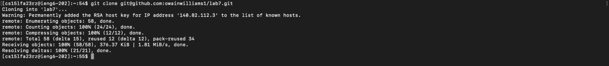

# Lab 4

Entire sequence:

```bash
ssh cs15lfa23rz@ieng6.ucsd.edu<enter>git clone git@github.
com:owainwilliams1/lab7.git<enter>cd lab7<enter>javac -cp .:lib/
hamcrest-core-1.3.jar:lib/junit-4.13.2.jar ListExamples.
java<enter>java ListExamplesTests.java<enter>java -cp .:lib/
hamcrest-core-1.3.jar:lib/junit-4.13.2.jar org.junit.runner.
JUnitCore ListExamplesTests<enter>vim L<tab>.
<tab>43jer2:wq<enter><up><up><up><enter><up><up><up><enter>git add 
-A<enter>git commit -m "bugfix"<enter>git push<enter>
```

### Log into ieng6

```bash
$ ssh cs15lfa23rz@ieng6.ucsd.edu<enter>
```

- `ssh` create a connection to the provided host.
- `cs15lfa23rz@ieng6.ucsd.edu` the host url.
- `<enter>` run the command.



### Clone your fork of the repository from your Github account

```bash
$ git clone git@github.com:owainwilliams1/lab7.git<enter>
```

- `git clone` copys the remote repository at the provided url to the machine.
- `git@github.com:owainwilliams1/lab7.git` the repository url.
- `<enter>` run the command.



### Run the tests, demonstrating that they fail

```bash
$ cd lab7<enter>
```

- `cd` changes the working directory to the provided folder.
- `lab7` the provided folder.
- `<enter>` run the command.



```bash
$ javac -cp .:lib/hamcrest-core-1.3.jar:lib/junit-4.13.2.jar ListExamples.java<enter>
$ java ListExamplesTests.java<enter>
```

- `javac` compiles java files.
- `-cp` sets the appropriate class path for java.
- `<enter>` run the command.
- `java` run a java file at the provided path.
- `ListExamplesTests.java` the file to run.
- `<enter>` run the command.


```bash
$ java -cp .:lib/hamcrest-core-1.3.jar:lib/junit-4.13.2.jar org.junit.runner.JUnitCore ListExamplesTests<enter>
```

- `java` run a java file at the provided path.
- `-cp` sets the appropriate class path for java.
- `ListExamplesTests` the class to run.
- `<enter>` run the command.



### Edit the code file to fix the failing test

```bash
$ vim L<tab>.<tab>43jer2:wq<enter>
```

- `vim` open the file in vim.
- `L<tab>` autofills the filename.
- `.<tab>` autofills the extension to use the `.java` file.
- `43jer2:wq` Moves 43 lines down, moves to the end of the first word and replaces the last letter with the letter 2. Then `:wq` saves and writes the file.
- `<enter>` run the command.



### Run the tests, demonstrating that they now succeed

```bash
$ <up><up><up><enter>
$ <up><up><up><enter>
```

- `<up><up><up><enter>` runs the third last command.


### Commit and push the resulting change to your Github account

```bash
$ git add -A<enter>
$ git commit -m "bugfix"<enter>
$ git push<enter>
```

- `git add` adds the files to be added.
- `git commit -m <message>` bundles the files into a commit with the provided message.
- `git push` pushes the commit to the remote repository.


