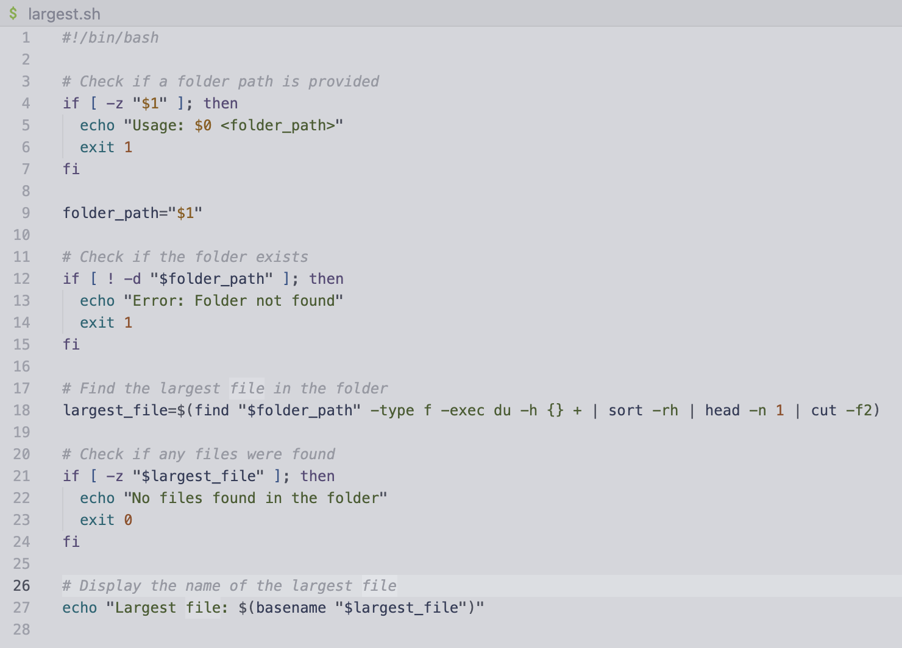

# Lab 5

Design a debugging scenario, and write your report as a conversation on EdStem.

## Post

I am attempting to create a bash script which finds the largest file
in a folder; however, it seems that it is finding a file that is in
a subdirectory. I cannot figure out how to stop it from searching in
subdirectories. Here is a screenshot of my code:



## Response

Nice script! When trying to find more information on a command you
can use `man <command>` to see the manual. If you know what you are
looking for you can type `/<query>` to find specific words. The issue
seems to be with the `find` command. After running `/sub` and not
finding anything, I tried `/depth` and found the argument
`-maxdepth <n>` which specifies the maximum number of subdirectories
to search.

Try adding `-maxdepth 1` to the find command in your script.

## Result


## Setup

### The file & directory structure needed

Using the file structure in this repository and running from the
root directory of the repo.

### The contents of each file before fixing the bug

```bash
#!/bin/bash

# Check if a folder path is provided
if [ -z "$1" ]; then
  echo "Usage: $0 <folder_path>"
  exit 1
fi

folder_path="$1"

# Check if the folder exists
if [ ! -d "$folder_path" ]; then
  echo "Error: Folder not found"
  exit 1
fi

# Find the largest file in the folder
largest_file=$(find "$folder_path" -type f -exec du -h {} + | sort -rh | head -n 1 | cut -f2)

# Check if any files were found
if [ -z "$largest_file" ]; then
  echo "No files found in the folder"
  exit 0
fi

# Display the name of the largest file
echo "Largest file: $(basename "$largest_file")"
```

### The full command line (or lines) you ran to trigger the bug

```
./largest.sh .
```

### A description of what to edit to fix the bug

Adding `-maxdepth 1` to line 18 of the file largest.sh fixes the bug.

## Reflection

I found out about github pages and it has encouraged me to create
a portfolio page as a supplement to my resume at
[owainwilliams1.github.io](https://owainwilliams1.github.io) I also
learned a lot about vim and the shortcuts that are helpful for file editing.